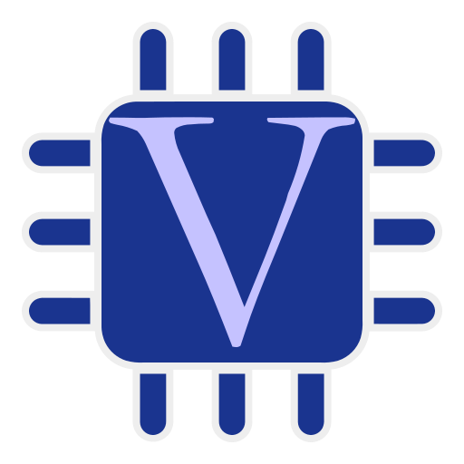

<h1 align="center">
   
  
   
  Verilog
   
</h1>

Olá, seja bem vindo a este repositório. Aqui eu tento documentar o que fiz enquanto estudava a [linguagem de descrição de hardware](https://en.wikipedia.org/wiki/Hardware_description_language) [Verilog](https://en.wikipedia.org/wiki/Verilog). Pretendo aumentar a lista e categorizar também. Sinta-se a vontade para sugerir mudanças e melhorias!

### Lista

- [Porta AND de 2 entradas](and2)
- [Flip Flop D](ffd)
- [Hello World](hello)
- [Porta OR de 2 entradas](or2)

## Contribuindo

Pull requests são sempre bem vindos, posso ter esquecido de alguma coisa, ou me passado em algo. Se for uma mudança grande, abre uma Issue antes pra gente discutir as mudanças. Obrigado!

## Licença

[GPL-3.0 License](LICENSE)

Icons made by <a href="https://www.freepik.com" title="Freepik">Freepik</a> from <a href="https://www.flaticon.com/" title="Flaticon">www.flaticon.com</a>

